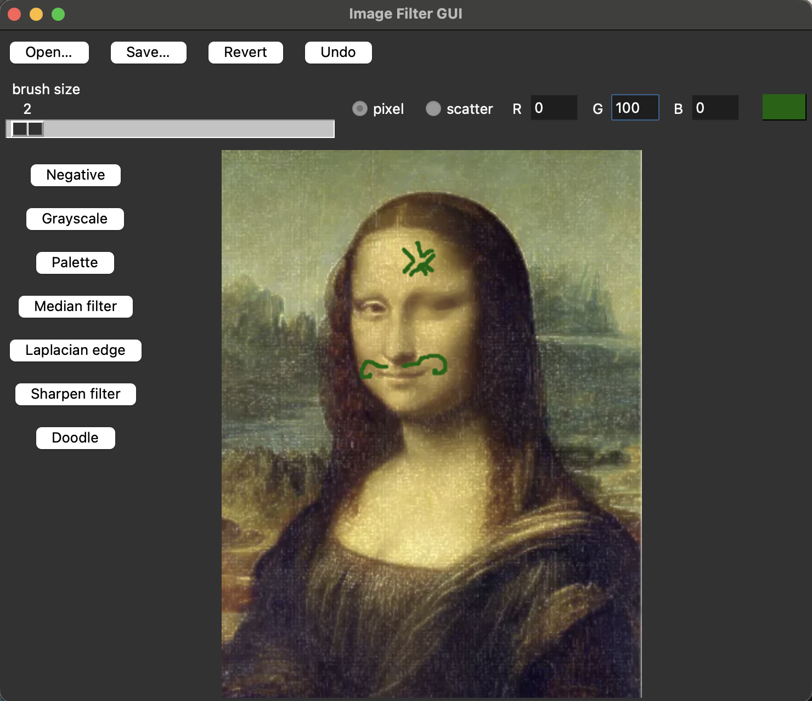
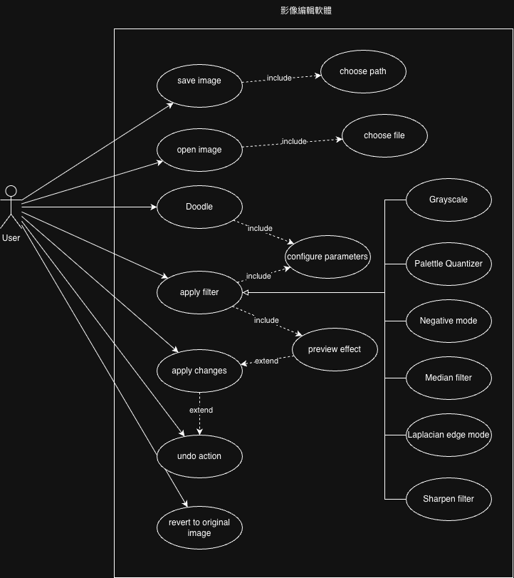
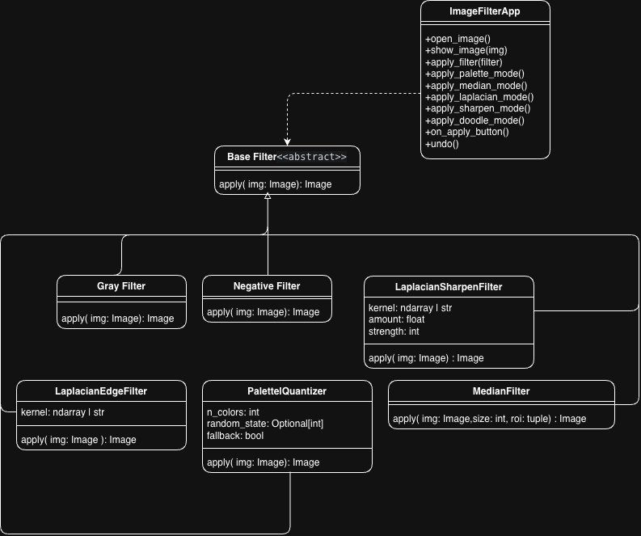
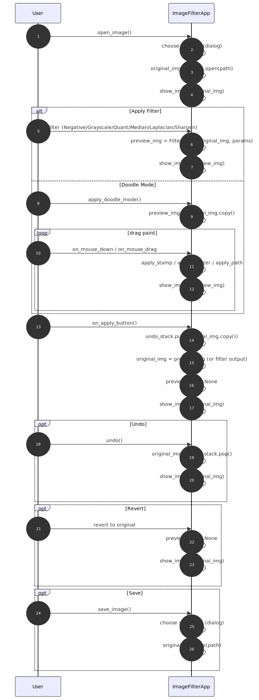
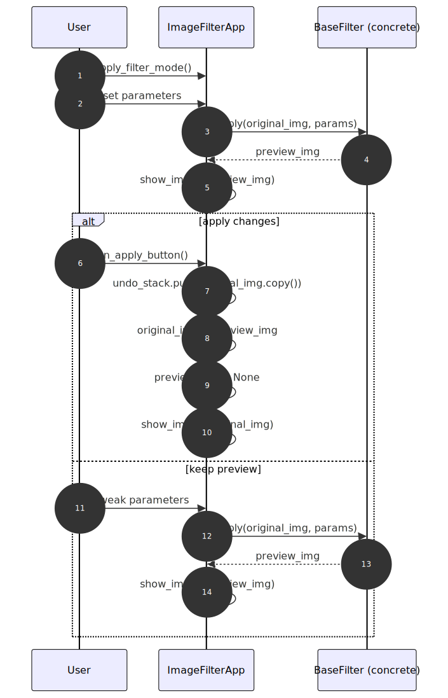
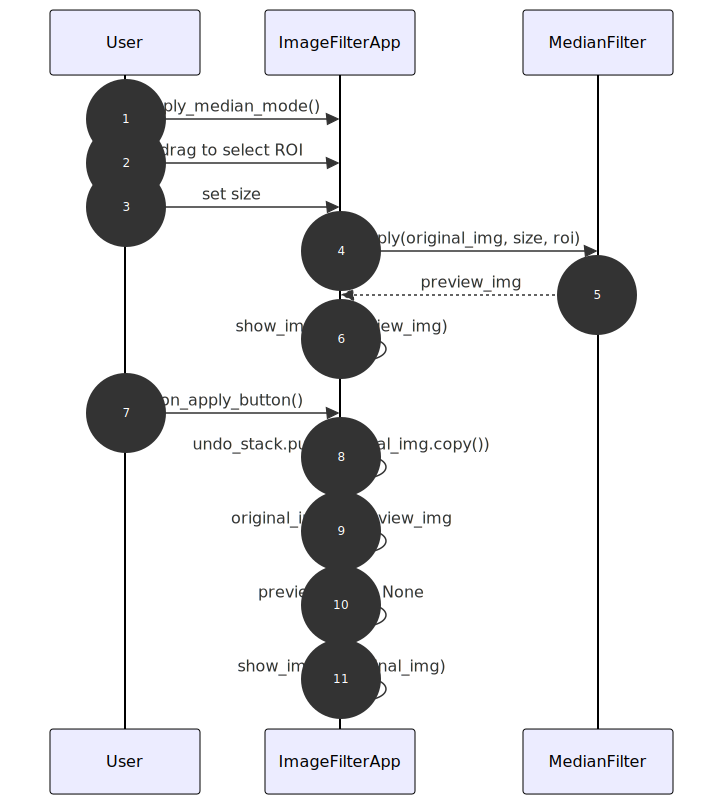
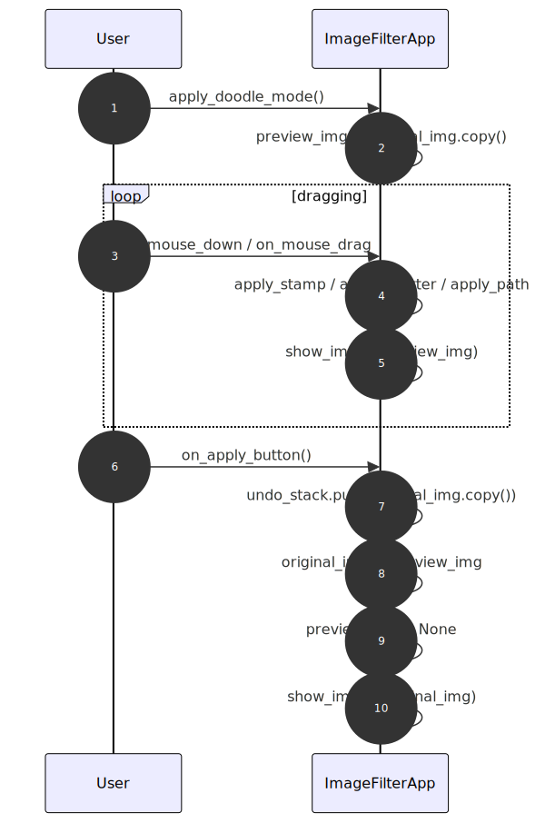
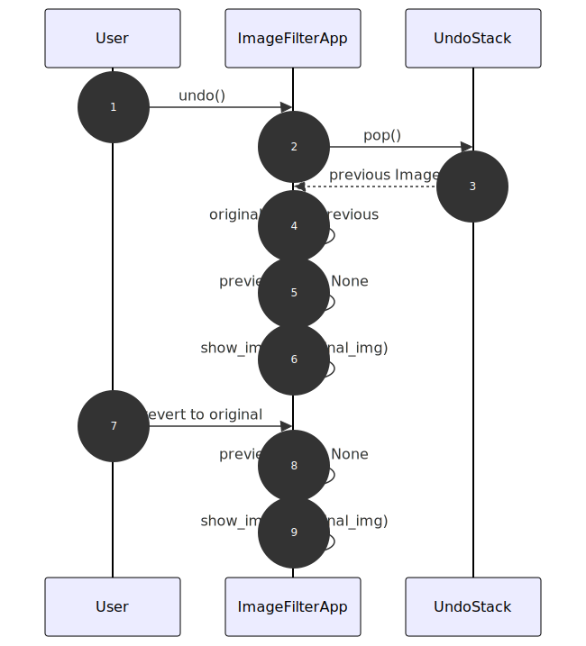

# 期末作業：影像處理工具

本目錄包含一個基於 Tkinter 的圖像處理小工具（`gui.py`）。支援開啟/儲存圖片、常見濾鏡，以及在圖片上進行塗鴉，並提供撤銷與固化（apply）功能。

功能概覽：
- 開啟/儲存：支援 `PNG/JPEG/BMP/TIFF`
- 濾鏡：負片、灰階、調色盤（KMeans 的簡化替代）、中位數濾波（支援選區 ROI）、拉普拉斯邊緣、拉普拉斯銳利化
- 塗鴉：兩種畫筆
 - Pixel：以半徑畫圓形實心筆觸，拖曳連續繪製
 - Scatter：以面積均勻散點，拖曳產生毛筆軌跡效果
- 畫筆設定：`Brush Size`、`RGB` 三格（附顏色預覽）、`Pixel/Scatter` 選擇
- 預覽與固化：在預覽圖上操作，點擊 `apply` 固化到原圖，可用 `Undo` 回退

使用方法：
- 安裝依賴（見 `requirements.txt`）
- 運行：`python gui.py`
- 從左側選擇功能：`Palette/Median/Laplacian/Sharpen/Doodle`
- 上方按鈕說明： `open` 開啟圖片，`save` 儲存圖片，`apply` 固化到原圖，`undo` 回退，`revert` 重設到原始圖片
- 塗鴉模式下：在頂部調整畫筆與顏色，在圖片上點擊或拖曳繪製

