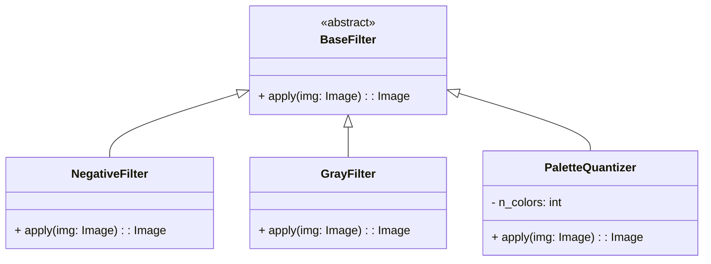

# hw3/main.py 类图（简化版）

仅保留核心图像处理逻辑的概念类，去除 GUI 相关内容。

## 说明
- BaseFilter：抽象基类，统一方法签名 `apply(img)`（Python 可用 `abc.ABC` 或鸭子类型约定）。
- NegativeFilter：对应脚本函数 `negative(img)`。
- GrayFilter：对应脚本函数 `gray(img)`。
- PaletteQuantizer：对应脚本函数 `palette_image(img, n_colors)`，包含 `n_colors` 属性。

## 与现有脚本的映射
- 目前为函数式脚本；此类图将三个处理函数抽象为三个实现类，并用一个接口统一调用方式，方便后续扩展（如新增滤镜）。